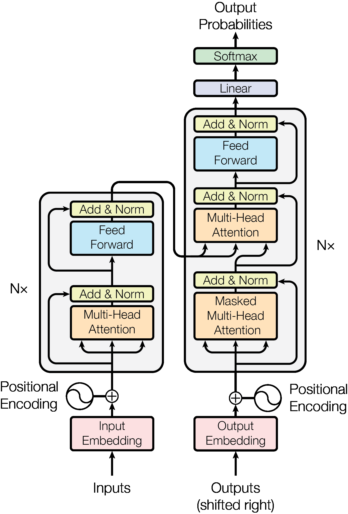
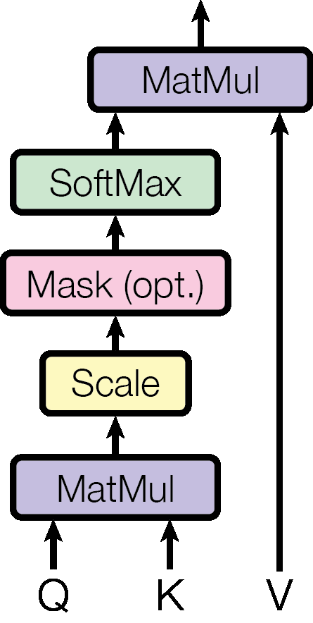
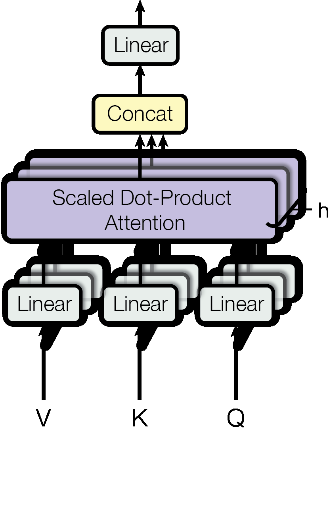

# Attention Is All You Need

!!! warning "Stage 1 only"
    Stage 2 refinement was not performed. Methods/Findings may be limited.

**Link**: https://arxiv.org/abs/1706.03762  
**Authors**: Ashish Vaswani, Noam Shazeer, Niki Parmar, Jakob Uszkoreit, Llion Jones, Aidan N. Gomez, Lukasz Kaiser, Illia Polosukhin  
**Institution**:   
**Venue**: arXiv:1706.03762 [cs.CL] (2017)  
**Model**: `claude-sonnet-4-5-20250929`

---
## Abstract

The dominant sequence transduction models are based on complex recurrent or convolutional neural networks in an encoder-decoder configuration. The best performing models also connect the encoder and decoder through an attention mechanism. We propose a new simple network architecture, the Transformer, based solely on attention mechanisms, dispensing with recurrence and convolutions entirely. Experiments on two machine translation tasks show these models to be superior in quality while being more parallelizable and requiring significantly less time to train. Our model achieves 28.4 BLEU on the WMT 2014 English-to-German translation task, improving over the existing best results, including ensembles by over 2 BLEU. On the WMT 2014 English-to-French translation task, our model establishes a new single-model state-of-the-art BLEU score of 41.8 after training for 3.5 days on eight GPUs, a small fraction of the training costs of the best models from the literature. We show that the Transformer generalizes well to other tasks by applying it successfully to English constituency parsing both with large and limited training data.

---
## Summary

### 1. Abstract 요약

이 논문은 sequence transduction 작업에서 지배적이었던 recurrent neural network나 convolutional neural network 대신, attention mechanism만으로 구성된 새로운 네트워크 아키텍처인 Transformer를 제안합니다. 기존 모델들은 encoder-decoder 구조에 attention을 추가하는 방식이었지만, Transformer는 recurrence와 convolution을 완전히 제거하고 오직 attention만을 사용합니다.

WMT 2014 English-to-German 번역 작업에서 28.4 BLEU를 달성하여 기존 최고 성능을 2 BLEU 이상 개선했으며, English-to-French 번역에서는 8개 GPU로 3.5일 훈련 후 41.8 BLEU로 새로운 single-model SOTA를 달성했습니다. Transformer는 병렬화가 훨씬 용이하여 훈련 시간을 대폭 단축시켰으며, English constituency parsing 등 다른 작업에도 성공적으로 적용되어 뛰어난 일반화 능력을 입증했습니다.

### 2. 한 줄 핵심 요약

Recurrence와 convolution을 완전히 제거하고 self-attention만으로 구성된 Transformer 아키텍처를 제안하여 machine translation에서 SOTA를 달성하고 훈련 효율성을 크게 개선했습니다.

### 3. Contribution

1. **Self-attention 기반 아키텍처**: RNN이나 CNN 없이 순수하게 attention mechanism만으로 구성된 최초의 sequence transduction 모델 제안
2. **병렬화 효율성**: Sequential computation의 제약을 제거하여 훈련 시 병렬화를 크게 개선
3. **SOTA 성능**: WMT 2014 English-to-German 및 English-to-French 번역 작업에서 새로운 최고 성능 달성
4. **일반화 능력**: Machine translation 외에도 English constituency parsing 등 다양한 작업에 성공적으로 적용
5. **Scaled Dot-Product Attention 및 Multi-Head Attention**: 효율적이고 효과적인 attention mechanism 설계

### 4. Methods

#### 핵심 아이디어
- **Attention-only 아키텍처**: Recurrent layer와 convolutional layer를 완전히 제거하고 self-attention만으로 sequence의 representation 계산
- **Multi-Head Attention**: 여러 representation subspace에서 병렬로 attention을 수행하여 다양한 위치의 정보를 jointly attend
- **Position Encoding**: Recurrence가 없으므로 sequence의 순서 정보를 주입하기 위해 positional encoding 사용
- **Constant path length**: 임의의 두 position 간 dependency를 학습하는데 필요한 연산 수를 상수로 감소 (기존 CNN/RNN은 거리에 따라 증가)

#### 모델 구조
**Encoder-Decoder 구조:**
- Encoder: 6개 동일 layer stack
  - 각 layer: Multi-head self-attention + position-wise fully connected feed-forward network
  - Residual connection + layer normalization 적용
- Decoder: 6개 동일 layer stack
  - Encoder의 2개 sub-layer + encoder output에 대한 multi-head attention
  - Masked self-attention으로 auto-regressive 속성 유지
- 모델 dimension: d_model = 512

**Scaled Dot-Product Attention:**
- Query, Key, Value로 구성
- Attention(Q, K, V) = softmax(QK^T/√d_k)V
- Scaling factor √d_k로 dot product 크기 조정

**Multi-Head Attention:**
- h=8개의 parallel attention layer
- 각 head는 서로 다른 learned linear projection 사용
- Head dimension: d_k = d_v = d_model/h = 64

**Position-wise Feed-Forward Networks:**
- FFN(x) = max(0, xW_1 + b_1)W_2 + b_2
- Inner dimension: d_ff = 2048

**Positional Encoding:**
- Sine/cosine 함수 사용
- PE(pos, 2i) = sin(pos/10000^(2i/d_model))
- PE(pos, 2i+1) = cos(pos/10000^(2i/d_model))

#### 데이터셋
**WMT 2014 English-to-German:**
- 약 4.5M sentence pairs
- Byte-pair encoding으로 37,000 token vocabulary
- Sentence batching by approximate sequence length

**WMT 2014 English-to-French:**
- 약 36M sentences
- 32,000 word-piece vocabulary

**English Constituency Parsing:**
- Wall Street Journal portion of Penn Treebank
- 약 40K training sentences

#### 평가방법
**Machine Translation:**
- BLEU score로 평가
- Beam search (beam size=4, length penalty α=0.6)
- Checkpoint averaging (마지막 5 또는 20 checkpoints)

**Parsing:**
- F1 score로 평가

#### 실험 결과
**Translation Performance:**
- WMT 2014 EN-DE: 28.4 BLEU (기존 최고 대비 +2.0 BLEU)
- WMT 2014 EN-FR: 41.8 BLEU (새로운 single-model SOTA)

**Training Efficiency:**
- Base model: 8 P100 GPUs, 12시간 (0.4초/step)
- Big model: 8 P100 GPUs, 3.5일 (1.0초/step)
- 기존 모델 대비 훨씬 적은 training cost

**Parsing Performance:**
- WSJ only: 91.3% F1 (기존 RNN 기반과 경쟁력 있음)
- Semi-supervised: 92.7% F1 (향상된 성능)

### 5. Findings

#### Objective Evaluations

**Translation Quality:**
- WMT 2014 EN-DE에서 ensemble 포함한 모든 기존 모델 outperform
- EN-FR에서 single-model SOTA 달성
- 훈련 비용은 기존 최고 모델의 극히 일부만 소요

**Model Variations:**
- Attention head 수(h): 1개보다 multi-head(8개)가 우수
- Attention key size(d_k): 너무 작으면 성능 저하
- Model size: 더 큰 모델(Big)이 더 좋은 성능
- Dropout: 정규화에 매우 효과적
- Positional encoding: Learned vs sinusoidal 유사한 성능

**Attention Visualization:**
- 서로 다른 head가 다른 task 수행
- 일부 head는 syntactic structure 포착
- Long-range dependency를 효과적으로 학습

#### Subjective Evaluations

**일반화 능력:**
- Machine translation뿐만 아니라 constituency parsing에도 성공적으로 적용
- Large/limited training data 모두에서 효과적

**효율성:**
- Sequential operation이 제거되어 병렬화 크게 개선
- RNN 대비 훨씬 빠른 훈련 속도
- Maximum path length가 O(1)로 long-range dependency 학습 용이

**설계 선택의 영향:**
- Self-attention이 다른 layer type(recurrent, convolutional) 대비 우수
- Computational complexity, sequential operations, maximum path length 모두에서 유리

### 6. Notes

#### 의미
- **Paradigm shift**: Sequence modeling에서 recurrence를 attention으로 완전히 대체 가능함을 입증
- **영향력**: Transformer 아키텍처는 BERT, GPT 등 후속 모델들의 기반이 되어 NLP 연구의 새로운 시대를 열었음
- **범용성**: Machine translation뿐만 아니라 다양한 sequence transduction 작업에 적용 가능
- **효율성과 성능의 양립**: 병렬화를 통한 훈련 효율성 개선과 동시에 성능도 향상
- **Interpretability**: Attention weight visualization을 통해 모델의 동작 이해 가능

#### 한계
- **Long sequence 처리**: Self-attention의 computational complexity가 sequence length의 제곱에 비례 (O(n²))
- **Sequential generation**: Decoder는 여전히 auto-regressive하여 generation이 sequential
- **Local pattern**: Text의 local structure를 명시적으로 모델링하지 않음
- **Inductive bias 부족**: CNN/RNN과 달리 구조적 inductive bias가 적어 더 많은 데이터 필요할 수 있음
- **Memory 요구사항**: 긴 sequence에서 attention matrix 저장에 많은 메모리 필요

#### 코드/데모
- **공식 구현**: https://github.com/tensorflow/tensor2tensor
- **재현 가능성**: 논문에 모든 hyperparameter와 training detail 명시
- **확장성**: Image, audio, video 등 다른 modality로의 확장 계획 언급
- **Open source**: 커뮤니티가 다양한 framework(PyTorch, JAX 등)로 재구현

---
### 7. Figures/Tables

**Figure 1: The Transformer - model architecture.**

**Figure 2: (left) Scaled Dot-Product Attention. (right) Multi-Head Attention consists of several**

**(p.4)**

